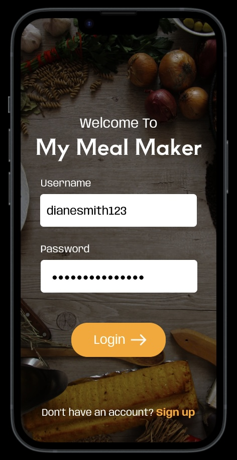
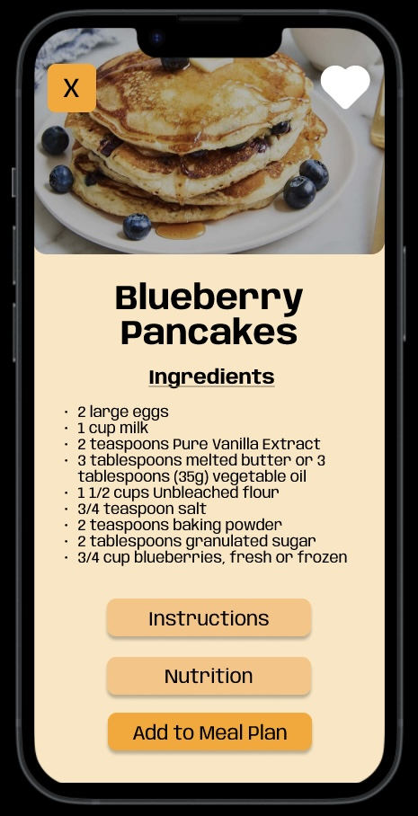
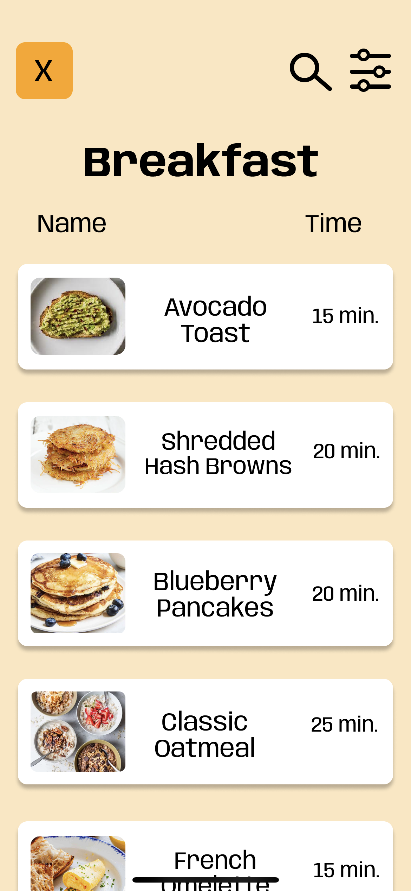
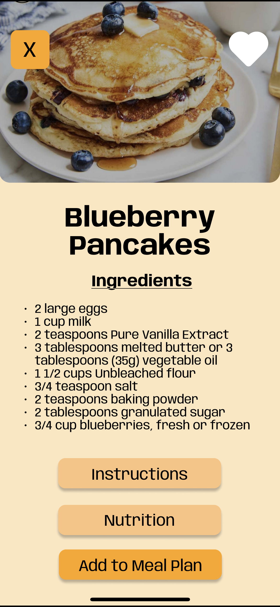
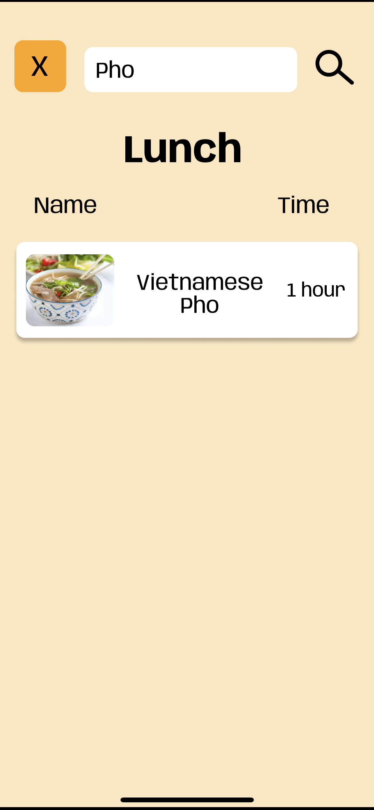
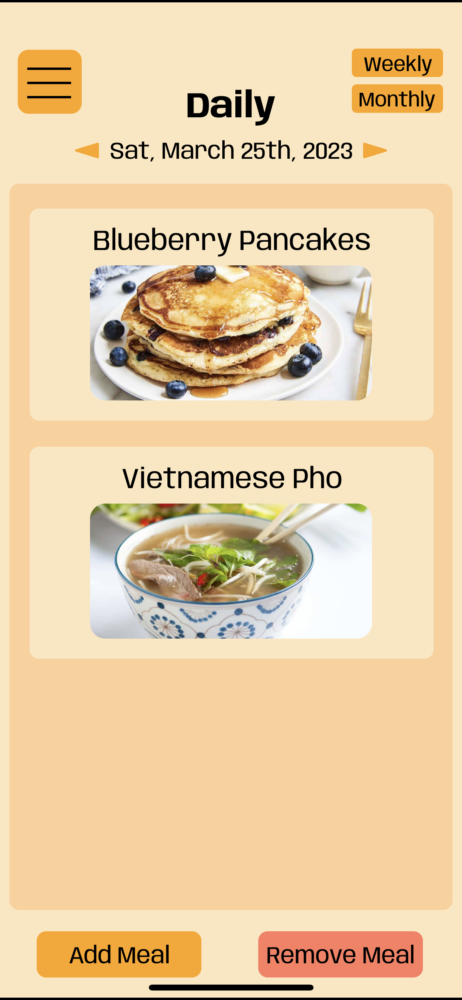

# My Meal Planner

Live Demo: https://www.figma.com/file/84l6cjhJpR0c83HfmvahGG/My-Meal-Planner?node-id=0%3A1&t=4x8Vmzwt654RsFV0-1

## Team Members
- Vy Nguyen
- Santi Gutierrez
- Miguel Contreras
- Aisha Jones
- Marissa Morones
  
## Problem Statement
Many people struggle with meal planning due to various reasons:
- Not enough time to plan an entire week of meals
- Not being able to come up with a healthy eating plans with enough nutritions
- Not enough budget to follow meal plans on the Internet

## Project Overview
Our project aims to address the above meal planning challenges by creating a user-friendly and intuitive meal planning app prototype. The app will provide accessible, healthy meal options, suitable for a variety of dietary needs and budgets while maintaining a balance between features and designs. Our target audience primarily includes college students and individuals looking for assistance in meal planning to maintain a healthier lifestyle.

## Key Features
- Grocery list lenerator
- Nutritional information
- Daily/weekly/monthly calendar view
- Option to add or remove meals
- Search bar to search for specific recipes

## Application Design

Login Screen

Recipe List View

Recipe Info Screen

Filter Screen

Daily Calendar View

## Interactive Figma Prototype
Live Demo: https://www.figma.com/file/84l6cjhJpR0c83HfmvahGG/My-Meal-Planner?node-id=0%3A1&t=4x8Vmzwt654RsFV0-1

Prototype Task List:
1. Log in with an account
2. View your profile
3. Add Blueberry Pancakes for Breakfast for Saturday, March 25
4. Search for Lunch Vietnamese Pho and add it Saturday, March 25
5. View your grocery list
6. Remove Vietnamese Pho
7. Filter Lunch recipes with cook time from 20 - 40 minutes.
8. Mark Tomato Soup as your favorite

## Lessons Learned
1. Start Simple And Create A List of Ideas: 
Start small, then work your way up. Think about which features to have and details before moving on. Remove any features that may not be completed within the allotted time or are too complex.

*Example 1*: Begin with a basic meal planner for everyone. Gradually incorporate features that cater to your target audience to avoid design confusion.

*Example 2*: List top 3 features to add to the base model, then add additional features requested by the personas. Calorie count was not accomplished to to complexity of multiple screen additions and scenarios.

*Example 3*: Our plan for automatic grocery list and remove items on-hand was not yet been implemented because it requires each ingredient to be its own button. We also have not implemented viewing grocery list, which was one of our main points.

3. Plan Your Design Prior To Creating The Prototype:
Use organizational charts such as a flow chart of which task should be connected to the corresponding task.

*Example*: The calendar feature in our app was simple, however,  became difficult during the figma prototype design. In order to achieve this, we had to duplicate the process many times.

5. Test As You Go:
Test your design during the process and not only at the end. This will allow you to see fix any errors before proceeding to the next step. Once you master that, move on to the next step and make sure that it works with the previous step and continue the process.

*Example*: We ran into issues where we could not exit and stuck on the blueberry pancake screen during testing. The nutrition information was difficult to read along with the instructions. We could have tested the app prior to completing the task, to save time in fixing all the screens.

